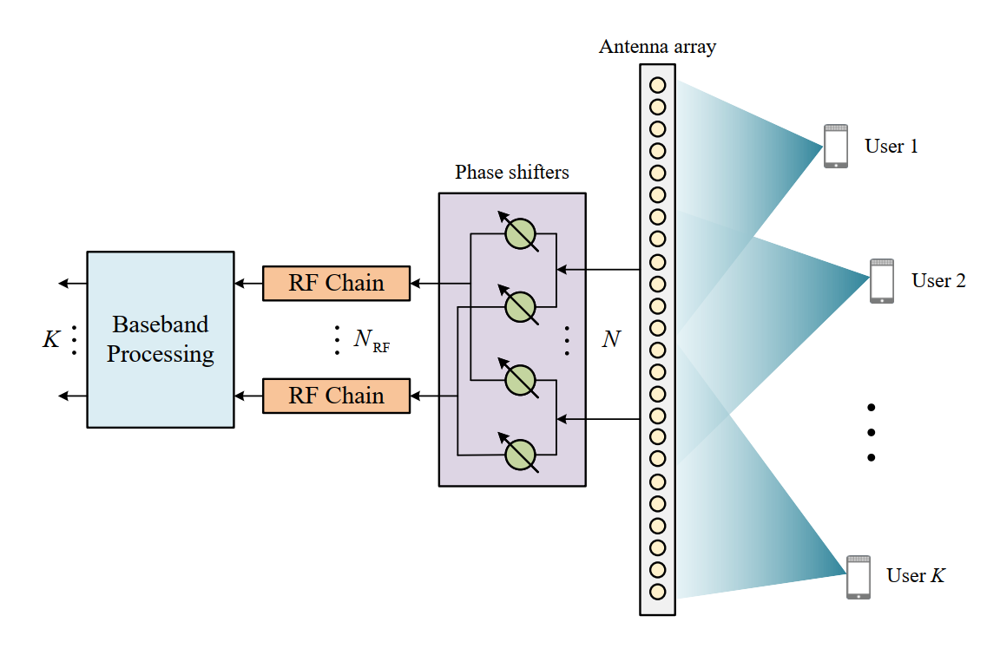

<b>Propose a group time block code (GTBC) based signal extraction scheme. Convert the spatial non-stationary channel into a series of stationary channels to realize accurate channel estimation.</b>

Extremely large-scale antenna array (ELAA) is considered as a key technology for future 6G communications. To realize effective precoding, channel estimation schemes are essential to acquire precise channel state information (CSI), while most existing schemes work relying on the spatial stationary assumption. However, in ELAA systems, the spatial non-stationary effect naturally exists. Such an effect can hardly be recognized by most existing channel estimation schemes, leading to a severe accuracy loss of channel estimation. In hybrid precoding based ELAA systems, this issue has not been addressed.

To fill in this gap, we study the spatial non-stationary channel estimation in ELAA systems in this paper. Specifically, the spatial non-stationary channel in an ELAA system is converted to a series of spatial stationary channels by a proposed group time block code (GTBC) based signal extraction scheme. The key idea is to artificially create the time-domain relevance of non-stationary effect, which brings ELAA the ability to recognize such effect in the space domain. Based on the extracted signals, an on-grid GTBC-based polar-domain simultaneous orthogonal matching pursuit (GP-SOMP) algorithm and an off-grid GTBC-based polar-domain simultaneous iterative gridless weighted (GP-SIGW) algorithm are proposed to effectively estimate the non-stationary channel. Then, analyses of the time complexity and performances of the above two algorithms are carried out and the Cramér-Rao lower bound is derived. Numerical results reveal that the proposed algorithms can recognize the spatial non-stationary effect and realize a much more accurate channel estimation than existing schemes.
