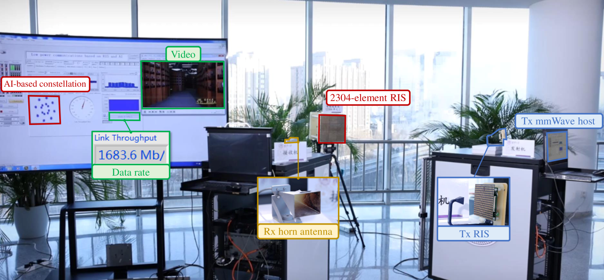
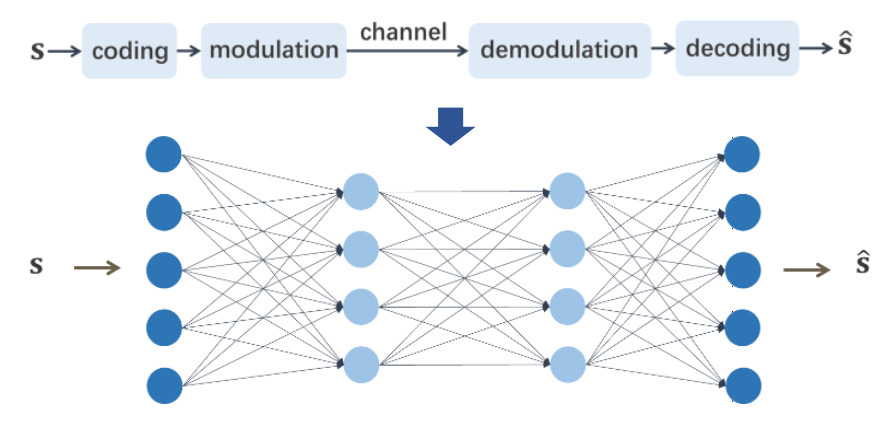
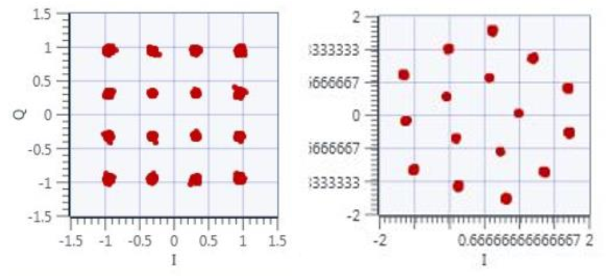
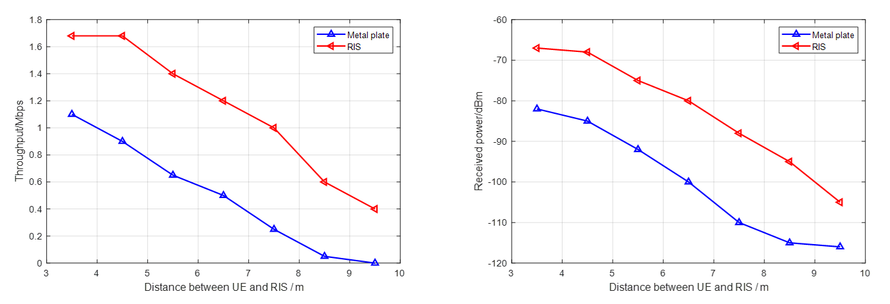

<b>This prototype integrates a 2304-element RIS and an AI-based end-to-end architecture.</b>

## AI-based end-to-end architecture

We break the traditional paradigm which divide the communication system into several modules. In order to realize a better performance, we train an end-to-end system off-line and deploy it on the FPGA.

The end-to-end system demonstrates several interesting results, including the unconventional constellation diagrams. The constellation diagrams vary with different training targets (e.g., minimum BER, mininum SER, etc.). This phenomenon reveals the potential of enhancing the performance of communication systems with AI.

## Algorithm verification & Field test

We utilize this prototype to verify the performance of the proposed [analytical beam training framework](https://hericenes.github.io/yuhaochen.github.io/research/analytical) and the proposed [FDF-based beam training framework](https://hericenes.github.io/yuhaochen.github.io/research/UCA). In addition, we verify the performance of the proposed [dynamic codebook](https://hericenes.github.io/yuhaochen.github.io/research/Accurate).

We also conduct field test based on the prototype. The results were reported at Global 6G Development Conference, 2022. 

